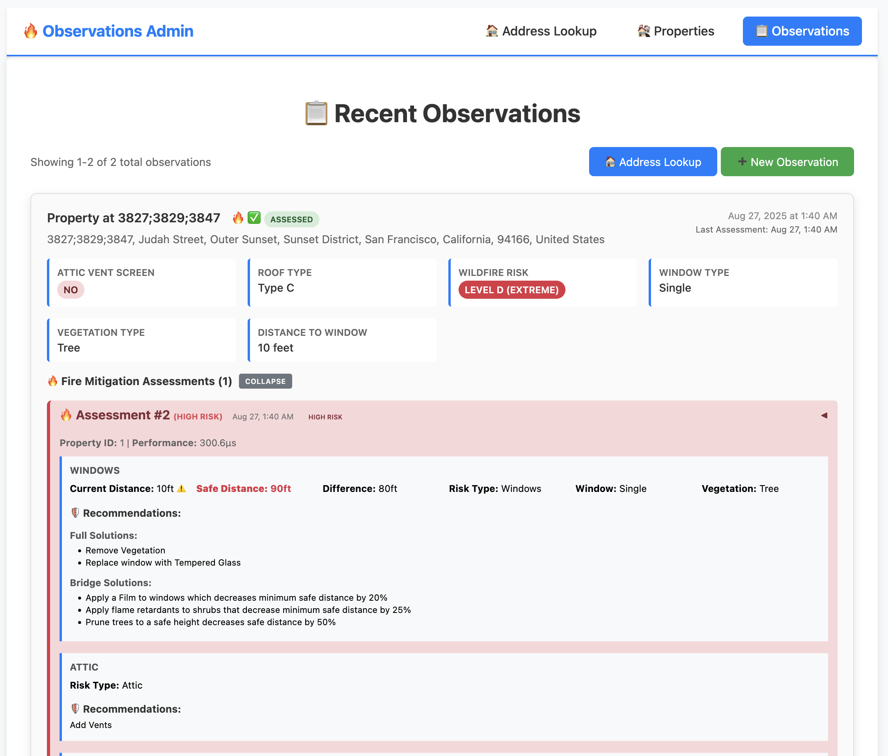
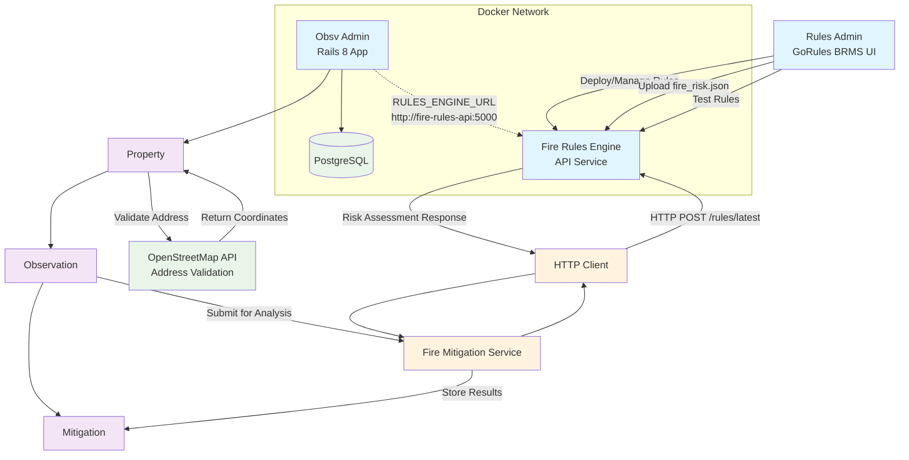

# Observation Admin

[](https://github.com/dyoun/obsv-admin/actions)
[](https://github.com/dyoun/obsv-admin/actions)

Rails 8 application to search properties, add/check observations against [fire rules mitigation](https://github.com/dyoun/fire-rules-eng).


## Quickstart

### Using docker-compose (Recommended)

The easiest way to run Observations Admin is using docker-compose:

```shell
docker-compose up
# visit http://localhost:3000 to access the app
```



Rules admin can be started with these [instructions](https://github.com/dyoun/rules-admin)

### Local Development

Start [fire rules API service](https://github.com/dyoun/fire-rules-eng?tab=readme-ov-file#quickstart)

```shell
rails db:create
rails db:migrate
rails db:seed

rails server
# http://localhost:3000 to access the address lookup form.
```

## Architecture Diagram


## Features

### Property Management
- Create and manage properties with comprehensive validation
- Support for multiple property types (residential, commercial, industrial, mixed_use, land)
- Property status tracking (active, inactive, pending, sold)
- Geographic capabilities with coordinate storage and distance calculations

### Observation System
- User-customizable observation forms with JSON data storage
- Flexible data structure for collecting property-specific information
- Timestamped observations with notes and custom fields
- Belongs to property relationship for organized data collection

### Address Lookup Interface
- **Interactive web form** for real-time address validation
- **OpenStreetMap integration** with live API calls
- **Responsive design** that works on mobile and desktop devices
- **AJAX-powered search** with loading states and error handling
- **Formatted results** displaying validated addresses and coordinates

### Address Validation System
The application includes a robust address validation system built with SOLID principles and enterprise design patterns:

#### Components
- **Property Model** - Main domain model with validations and business logic
- **AddressValidatable Concern** - Single responsibility module for address validation logic
- **Address Validation Services** - Strategy and Factory pattern implementation:
  - `BaseValidator` - Abstract base class (Open/Closed principle)
  - `OpenstreetmapValidator` - OpenStreetMap API integration with rate limiting
  - `NullValidator` - No-op validator for testing/development environments
  - `ValidationResult` - Value object for validation results
  - `AddressValidatorFactory` - Factory pattern for validator selection

#### SOLID Principles Applied
- **Single Responsibility**: Each class has one reason to change
- **Open/Closed**: Easy to add new validators without modifying existing code
- **Liskov Substitution**: All validators implement the same interface
- **Interface Segregation**: Clean, focused interfaces
- **Dependency Inversion**: Property model depends on abstractions, not concrete implementations

#### Address Validation Features
- **OpenStreetMap Integration**: Validates addresses against OpenStreetMap's Nominatim API
- **Rate Limiting**: Built-in rate limiting to respect API guidelines
- **Error Handling**: Comprehensive error handling for network issues and invalid responses
- **Geocoding**: Automatic coordinate extraction and normalization
- **Configurable**: Easy to switch between validators or disable for testing

## Setup

### Ruby version
- Ruby 3.x (Rails 8.0.2+)

### System dependencies
- PostgreSQL
- Internet connection for address validation

### Configuration
Configure the address validator in `config/application.rb`:
```ruby
config.address_validator = :openstreetmap  # Default
# or
config.address_validator = :null  # For development/testing
```

### Database setup
```bash
rails db:create
rails db:migrate
rails db:seed
```

### Running the application
```bash
rails server
```

Visit `http://localhost:3000` to access the address lookup form.

### Installation
```bash
bundle install
```

### How to run the test suite
```bash
rails test
```

The test suite includes:
- Model validations and business logic tests
- Address validation service tests with WebMock HTTP stubbing
- Geographic calculation tests
- Factory and strategy pattern tests

## Usage Examples

### Address Lookup Form
Access the interactive address lookup form at the root URL (`/`):
- Enter any address in the search field
- Real-time validation against OpenStreetMap
- View formatted addresses and coordinates
- Mobile-friendly responsive interface

### Creating a Property
```ruby
property = Property.create!(
  name: "Downtown Office Building",
  property_type: "commercial",
  status: "active",
  street_address: "123 Main Street",
  city: "San Francisco",
  state_province: "CA",
  postal_code: "94102",
  country: "US"
)

# Address will be automatically validated and geocoded
puts property.latitude   # Populated from OpenStreetMap
puts property.longitude  # Populated from OpenStreetMap
puts property.normalized_address  # Formatted address from OSM
```

### Geographic Operations
```ruby
# Find properties near coordinates
nearby = Property.near_coordinates(37.7749, -122.4194, 5) # 5km radius

# Calculate distance between properties
distance_km = property1.distance_to(property2)

# Check if coordinates are available
if property.coordinates_available?
  puts "Property is located at #{property.latitude}, #{property.longitude}"
end
```

### Querying Properties
```ruby
# Scopes
active_properties = Property.active
residential_properties = Property.by_type("residential")
sf_properties = Property.in_city("San Francisco")

# Chaining scopes
active_residential_in_sf = Property.active.by_type("residential").in_city("San Francisco")
```

### Working with Observations
```ruby
# Create a customizable observation
observation = property.observations.create!(
  observations: {
    "temperature" => 72.5,
    "humidity" => 45,
    "condition" => "excellent",
    "inspector" => "John Doe"
  },
  notes: "Regular maintenance inspection",
  recorded_at: Time.current
)

# Access custom field values
temperature = observation.custom_field_value("temperature")
observation.set_custom_field("pressure", 1013.25)

# Query observations
recent_observations = property.observations.recent
environmental_checks = Observation.recorded_between(1.week.ago, Time.current)
```

## Architecture

The address validation system follows enterprise patterns:

1. **Strategy Pattern**: Different validation strategies (OpenStreetMap, Null, etc.)
2. **Factory Pattern**: `AddressValidatorFactory` creates appropriate validator instances
3. **Dependency Injection**: Models depend on interfaces, not concrete classes
4. **Concern Pattern**: `AddressValidatable` encapsulates validation logic
5. **Value Objects**: `ValidationResult` encapsulates validation outcomes

This architecture makes the system:
- **Testable**: Easy to mock and stub external dependencies
- **Extensible**: New validators can be added without changing existing code
- **Maintainable**: Clear separation of concerns and single responsibilities
- **Configurable**: Runtime selection of validation strategies

## Services

- **Address Validation**: OpenStreetMap Nominatim API integration
- **Geocoding**: Automatic coordinate extraction and storage
- **Geographic Search**: PostGIS-ready coordinate indexing
- **Address Lookup Web Interface**: Interactive form for real-time address validation

## Models

### Property
- Core property management with address validation
- Geographic capabilities and distance calculations
- Relationship with observations for data collection

### Observation
- Flexible JSON-based data storage for custom forms
- Property relationship for organized data collection
- Timestamped entries with notes and custom fields
- Scopes for querying by date ranges and types

## Testing

The application includes comprehensive tests covering:
- Property model validations and business logic
- Address validation services with HTTP mocking
- Geographic calculations and distance measurements
- Error handling and edge cases
- Factory and strategy pattern implementations

Run tests with: `rails test`
